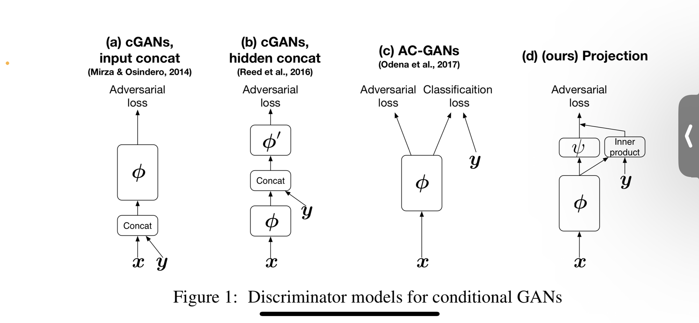

# DCGAN으로 SVHN 생성모델 만들기!

## SVHN Dataset
- http://ufldl.stanford.edu/housenumbers/
- 10 classes, 1: label 1, …  9: label 9, 0: label 10
- size of images : 32 x 32
- train : 73257 digits (73257x3x32x32) , test : 26032 digit (26043x3x32x32), additional : 531131

## DCGAN ( Deep Convolution Generative Adversarial Network)
- https://arxiv.org/pdf/1511.06434.pdf

G : Generative, 랜덤 노이즈 벡터를 입력받아 데이터 생성
D : Discriminator, 특정 데이터가 가짜인지 진짜인지 판별

---
1. + Conditional 
https://arxiv.org/pdf/1802.05637.pdf

그림 1의 a,b,c,d 다 해보기

**(a) cGANs, input concat**
paper : https://arxiv.org/abs/1411.1784

- Generator를 학습할 때 latent 벡터 z에 condition 변수 1-0 encoding된 벡터 y를 붙여줌
- Discriminator에도 동일하게  condition 변수 1-0 encoding된 벡터 y를 붙여줌

(b) cGANSs, hidden concat

---

-  TODO

(c) AC_GANs

(d) cGANS with projection discriminator
